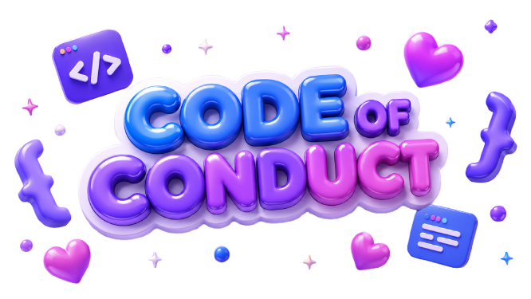

# 🌸 Word Devs — Code of Conduct

    (っ.❛ ᴗ ❛.)っ

**Welcome to our cozy space!**
_Let's build a safe, respectful, and friendly community together_ 💜✨

━━━━━━━━━━━━━━━━━━━━━━━━━━

## 🎀 Our Pledge

We, as members, contributors, and leaders of **Word Devs**, pledge to make participation in our community a harassment-free experience for everyone, regardless of age, body size, visible or invisible disability, ethnicity, sex characteristics, gender identity and expression, level of experience, education, socio-economic status, nationality, personal appearance, race, caste, color, religion, or sexual identity and orientation.

We commit to acting and interacting in ways that contribute to an open, welcoming, diverse, inclusive, and healthy community. 🌸

---

## 🦄 Our Standards

To maintain a sweet and productive space, we encourage behaviors that contribute to a positive environment:

- **Be Kind and Empathetic:** Demonstrate empathy and kindness toward other human beings.
- **Respect Others:** Be respectful of differing opinions, viewpoints, and experiences.
- **Constructive Feedback:** Gracefully accept constructive criticism.
- **Community-First:** Focus on what is best for the community, not just for ourselves.
- **Professionalism:** Use welcoming and inclusive language.

### ❌ Unacceptable Behaviors Include:

- The use of sexualized language or imagery, and unwelcome sexual attention or advances.
- Trolling, insulting or derogatory comments, and personal or political attacks.
- Public or private harassment of any kind.
- Publishing others' private information, such as a physical or email address, without their explicit permission (doxxing).
- Other conduct which could reasonably be considered inappropriate in a professional setting.

---

## 🛡️ Enforcement Responsibilities

Community leaders are responsible for clarifying and enforcing our standards of acceptable behavior and will take appropriate and fair corrective action in response to any behavior they deem inappropriate, threatening, offensive, or harmful.

Community leaders have the right and responsibility to remove, edit, or reject comments, commits, code, wiki edits, issues, and other contributions that are not aligned with this Code of Conduct.

---

## 📧 Reporting

If you experience or witness unacceptable behavior, or have any other concerns, please report it to us privately by sending a sweet but detailed email to:

👉 **[team@chocofactory.dev](mailto:team@chocofactory.dev)** 💌

All complaints will be reviewed and investigated promptly and fairly. We will respect the privacy and security of the reporter of any incident.

---

╭──────────────────────────────╮
🌸 **Thank you for keeping Word Devs safe!** 🌸
╰──────────────────────────────╯

_together, we make the dev world a happier place_ 💜✨

(っ˘▽˘)(˘▽˘)˘▽˘)っ

