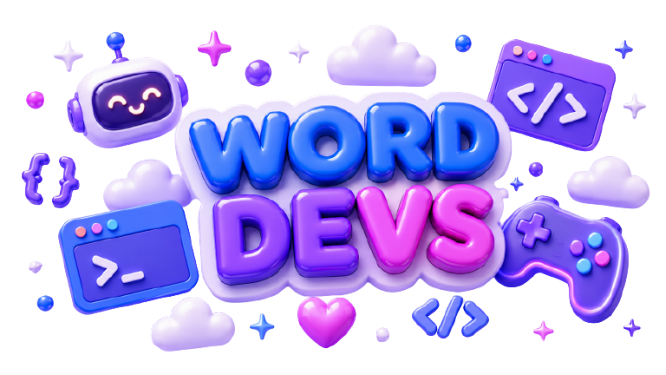

# 🌸 Word Devs — Welcome to our Workshop!

🛸✨ **Crafting playful, open-source tools with a little extra sparkle** 🧸🌸
_Welcome to our cozy hub of development! We build adorable, efficient, and modern open-source solutions._

━━━━━━━━━━━━━━━━━━━━━━━━━━

---

## 🦄 About Us

At **Word Devs**, we love combining high-performance software engineering with friendly, aesthetic user experiences. We specialize in developing rich interactive Discord bots, lightweight cryptographic utilities, and creative asset generators. Our goal is to make the developer world a happier, more playful place! 💻✨

---

## 🚀 Featured Projects

Here are the main stars of our workshop that you can explore right now:

<table>
  <tr>
    <td width="33%" align="center">
      <h3>🌸 Kannamy</h3>
        
      Our signature interactive Discord bot! Packed with entertainment, advanced leveling, and creative media systems.
        
      <a href="https://github.com/worddevs/kannamy"><b>View Project →</b></a>
    </td>
    <td width="33%" align="center">
      <h3>🔑 cf-keys</h3>
        
      A sweet, lightweight cryptographic and JWT toolkit built to handle secure user tokens with absolute simplicity.
        
      <a href="https://github.com/worddevs/cf-keys"><b>View Project →</b></a>
    </td>
    <td width="33%" align="center">
      <h3>🎨 kira-arts</h3>
        
      An automated asset and beautiful card generation engine designed to spice up profile rewards and statistics.
        
      <a href="https://github.com/worddevs/kira-arts"><b>View Project →</b></a>
    </td>
  </tr>
</table>

---

## 🛠️ Our Tech Stack

We enjoy building modern, blazing-fast tools using a wide variety of technologies:

- **Backend & Automation:** Node.js, JavaScript, TypeScript, GitHub Actions.
- **Frontend Interfaces:** React, Vite, Tailwind CSS.
- **Security & Data:** JWT, Cryptography standard libraries, secure database structures.

---

## 🤝 Join the Community

We believe open source thrives when we build together! If you want to drop by, suggest features, or help us code, here is how you can get started:

- 📖 read our friendly [Contributing Guidelines](.github/CONTRIBUTING.md) to understand our Git workflows.
- 🛡️ Check out our [Code of Conduct](.github/CODE_OF_CONDUCT.md) to help us maintain a safe, welcoming space.
- 💬 Open a discussion thread or ask a question in our general [Support Center](.github/SUPPORT.md).

---

## 💜 Supporting Our Magic

Word Devs is entirely powered by open-source love and sweet contributions. If our projects make your life easier or add a smile to your Discord servers, consider supporting us!

- 🌟 Give a star to our repositories (it makes us jump with joy!).
- ☕ Buy us a virtual coffee via our official platforms on our [Sponsor Page](.github/FUNDING.yml).

---

╭──────────────────────────────╮
🌸 **Thank you for visiting Word Devs!** 🌸
╰──────────────────────────────╯

_Made with passion, magic, and lots of code_ 🧸✨

(つ✧ω✧)つ ｡ﾟ✧ _have a wonderful day!_

